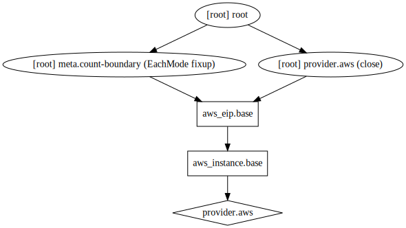

## Our first AWS configuration using Terraform

An initial configuration for Terraform.

## Usage

```
$ terraform plan
$ terraform apply
```

## License

[MIT](../../../LICENSE.md)

## Terraform graph

Here is the terraform graph of the resources in this configuration, 
