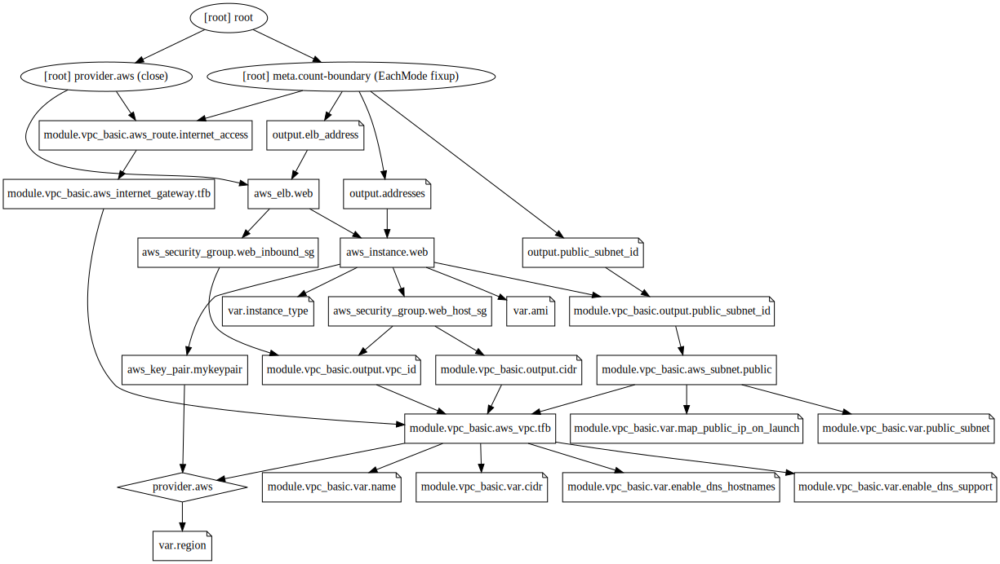

## Our second AWS configuration using Terraform.
We construct below infrastructure components for this example,
1. AWS VPC
2. Public subnet in above VPC.
3. Two security groups related to VPC. One security group for ELB to allow incoming http traffic and other for EC2 instances to allow incoming http and ssh traffic.
4. ssh-key to ssh to our EC2 instances.
5. Two EC2 instances.
6. Install Nginx on both EC2 instances remotely.
7. One ELB.

## Usage
```
terraform plan
terraform apply
```

## License  
[MIT](../../../LICENSE.md)

## Terraform graph
Here is the terraform graph of the resources in this configuration, 
