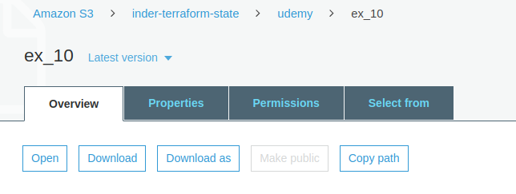
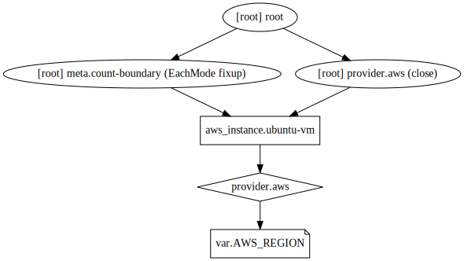

## Example 10
* In this example, we'll provision an EC2 instance.
* We'll store terraform state `terraform.tfstate` remotely in an S3 backend.
* By default terraform stores the state in local backend.
* We first created an S3 bucket in AWS.
* We enabled versioning on it (to store all versions and overcome accidental deletes).
* We need to configure AWS API keys using AWS CLI to use S3 as backend for terraform state. This is because the terraform code for configuring backend doesn't support terraform variables.
* We don't have `terraform.tfvars` file as we have configured secrets using AWS CLI.


## Steps
Created `var.tf, provider.tf, resource.tf, backend.tf`.

## Commands
```
terraform init
terraform validate
terraform plan
terraform apply
terraform destroy
alias svg='terraform graph > example.dot && dot example.dot -Tsvg -o example.svg'
svg
```

## Output
We get below output, after `terraform init`,

```
[~/github/terraform/udemy/ex_10]$ terraform init

Initializing the backend...

Successfully configured the backend "s3"! Terraform will automatically
use this backend unless the backend configuration changes.

Initializing provider plugins...
- Checking for available provider plugins...
- Downloading plugin for provider "aws" (hashicorp/aws) 2.36.0...
```

When we execute `terraform apply`, the resource is provisioned, but the `terraform.tfstate` file is not stored locally. It is stored in S3 instead. Below is the image. Basically, `terraform.tfstate` is a json file and it can be viewed in browser if stored in S3 backend.



Later, we destroyed the infra using `terraform destroy`.

It is worth mentioning that the `terraform.tfstate` file is stored in `inder-terraform-state` bucket, under `udemy` path and as `ex_10` file. It has been renamed. However, when I destroyed the infrastructure, the `terraform.tfstate.backup` file should have got created but it didn't. Maybe because of verisoning. However, it needs to be investigated further. Yes, it is because of versioning. Now the `terraform.tfstate.backup` won't be created as the previous version is stored in S3 bucket as it is along with new version of `terraform.tfstate`. All versions can be viewed in S3.

## Terraform graph


