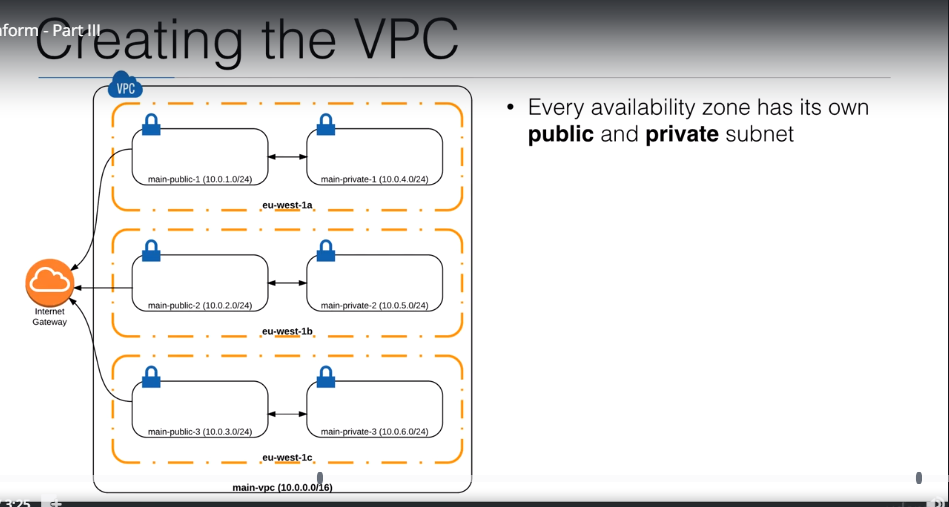
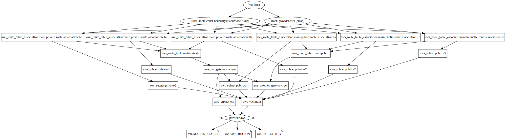

## Example 10
* In this example, we'll create a custom VPC.
* We defined our VPC, subnets (public and private) in it, IGW, route table, route table associations.
* Then we created `nat.tf` file in which we defined our NAT gateway, its dependency on our IGW, EIP associated to our NAT gateway, subnet in which it is placed, route table to direct traffic from private subnets to NAT gateway, and associations of this route table with our private subnets.
* Below is an image of the AWS infrastructure we're planning to deploy,



## Steps
Created `vpc.tf, nat.tf, provider.tf, var.tf`.

## Commands
```
terraform init
terraform fmt
terraform validate
terraform plan
terraform apply
terraform destroy
alias svg='terraform graph > example.dot && dot example.dot -Tsvg -o example.svg'
svg
```

## Terraform graph


