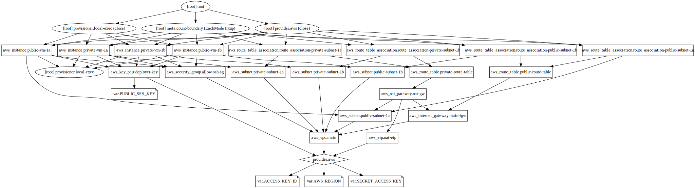

## Example 13
* In this example, we'll create a custom VPC, 2 public subnets and 2 private subnets in it.
* We defined our VPC, subnets (public and private) in it, IGW, route table, route table associations.
* Then we created `nat.tf` file in which we defined our NAT gateway, its dependency on our IGW, EIP associated to our NAT gateway, subnet in which it is placed, route table to direct traffic from private subnets to NAT gateway, and associations of this route table with our private subnets.
* Then we'll launch an EC2 instance in public subnet 1a with an ssh key pair.
* Attach a security group to it to allow ssh access to it.
* Using `local-exec` provisioner in `aws_instance` for public instances, we have outputted the public IP addresses for the 2 public instances into `public_ip.list` file. we'll perform below tasks from here,
  * [ * ] We'll try to connect to both public instances using our private ssh key and these public IP addresses.
  * [ * ] From there we'll try to reach to internet `ping google.com`.
  * [ * ] From one public instance, we'll try to ssh to other public instance. This should work. This will require ssh key forwarding. It worked. But I again tried to ssh back to public host 1 and it failed (maybe ssh key forwarding works till only 2 hosts and not beyond that).
  * [ * ] From one of the public instance we'll try to ssh to the two private instances using their private IP addresses. It should work. This also needs ssh key forwarding.
  * [ * ] From private instances, we'll try to reach to internet. This should work. We pinged `google.com` and it worked. We updated `apt-get` repos by executing `sudo apt-get update` and also installed `traceroute` package using `apt-get`. It got installed. This means our instance in private subnet is able to reach the internet. Then we traced route to `google.com` using `traceroute` command and the first hop was at IP address `10.0.1.102` which is the private IP address of our NAT instance in public-subnet-1a.
  * [   ] From one private instance we'll try to ssh to other private instance. It didn't work as (maybe) ssh key forwarding doesn't work while tryinh to ssh to the third instance in a row.
* Using `local-exec` provisioner in `aws_instance` for private instances, we have outputted the private IP addresses for the 2 private instances into `private_ip.list` file.

## Steps
Created `vpc.tf, subnets.tf, internet_gateway.tf, route_tables.tf, nat.tf, terraform.tfvars, var.tf, provider.tf, security_group.tf, key_pair.tf, instances.tf, id_rsa`.

## Commands
```
terraform init
terraform fmt
terraform validate
terraform plan
terraform apply
ssh -A public_ip -l ubuntu -i private_key (with ssh key forwarding)
terraform destroy
alias svg='terraform graph > example.dot && dot example.dot -Tsvg -o example.svg'
svg
```

## Terraform graph


