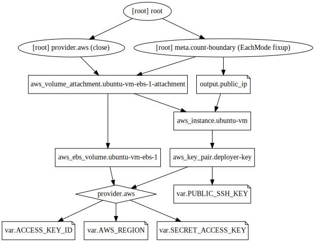

## Example 14
* In this example we'll attach an additional EBS to our EC2 instance.
* By default our `t2.micro` comes with an 8 GB EBS storage/disk wherein the OS is installed. This is the root volume.
* Adding additional disks to our instance (i.e. additional EBS) can help create multiple file systems and increase disk space.
* When an EC2 instance is terminated, the root volume EBS is also terminated but the additional EBS disks has to be separately deleted (either maunally or using terraform).
* However, we can instruct AWS to not delete root volume EBS on termination of EC2 instance (but this is counter intuitive).
* We create an EBS volume in terraform using `aws_ebs_volume` resource, and then attach it to our instance by using `aws_volume_attachment` resource.
* If we want to increase root volume size of our instance, we can specify it `root_block_device` attribute in our `aws_instance` resource.
* The `availability_zone` attribute is necessary in `aws_ebs_volume` block. So, inorder to provision our EC2 instance also in the same `availability_zone`, we will use `availability_zone` attribute in `aws_instance` resource block. This helps to reduce distance between instance and its NAS (EBS volume). This can also be done using VPC and subnets, but we didn't try it.
* We create a file systemfrom our additional volume and mount it. Make an entry ofit in `/etc/fstab` file. Now if instance is rebooted, the file system will be automatically mounted.
* But if we terminate our EC2 instance and relaunch it, the additional EBS volume won't be deleted, but re-attached to our EC2 instance. But again we'll have to create a file system for it and mount it and make an entry for it in `/etc/fstab` file. This is where we can use `userdata`. Whatever we specify in `userdata` will be executed when the instance is launched. So, this will automatically create a file system whenever the instance is launched. We need to check if we use a script or individual commands in `userdata`. We can also make use of `provisioner` and `remote-exec`, but they can specifically be used to perform configuration management across hosts after provisioning or anytime during the lifecycle. If we perfomr it anytime during the lifecycle, then it will be performed everytime we relaunch instances after termination from next time onwards. This needs to be understood further.
* Even after specifying `force_detach` as `true` in `aws_volume_attachment` block, I had to execute `terraform destroy` multiple times as EBS volume was not getting detached properly.
* Refer this [link](https://docs.aws.amazon.com/AWSEC2/latest/UserGuide/ebs-detaching-volume.html) to properly detach an EBS volume from an EC2 instance.

## Steps
Created `terraform.tfvars, var.tf, provider.tf, key_pair.tf, instances.tf, ebs.tf, output.tf, id_rsa`.

## Commands
```
terraform init
terraform fmt
terraform validate
terraform plan
terraform apply
ssh public_ip -l ubuntu -i private_key
sudo su -
df -h
mkfs.ext4 /dev/xvdh
mkdir /data
mount /dev/xvdh /data
echo "/dev/xvdh /data ext4 default 0 0" >> /etc/fstab
umount /data
mount -a
terraform destroy
alias svg='terraform graph > example.dot && dot example.dot -Tsvg -o example.svg'
svg
```

## Terraform graph


