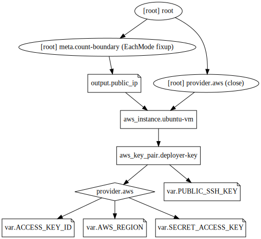

## Example 15
* `user_data` will be executed only at the launch of an EC2 instance and not if the instance is rebooted, stopped, started again, or terminated.
* We can perform below tasks using `user_data`,
  * We can install extra software.
  * Prepare instance to join a cluster (eg- consul cluster, ECS cluster)
  * Execute commands/scripts.
  * Mount volumes.
* `user_data` can be implemented using two ways,
  * Using string
  * Using template
* Using string helps to execute simple commands while using a template provides us ability to perform more complex tasks.
* Here, we'll simply use a string in `user_data`. But refer video for a good example on template.
* Here, user_data will install openvpn application at launch.
* In user_data, we specified a bash script as a string wherein "\n" denotes a new line.
* We can enhance this further to generate openssl certificates for users to connect to.
* To verify openvpn installation, we later sshed to the instance and executed `sudo dpkg -l | grep -i openvpn` and got our pakage listed as installed.

## Steps
Created `terraform.tfvars, var.tf, provider.tf, key_pair.tf, instances.tf, output.tf, id_rsa`.

## Commands
```
terraform init
terraform fmt
terraform validate
terraform plan
terraform apply
ssh public_ip -l ubuntu -i private_key
sudo su -
dpkg -l | grep -i openvpn
exit
terraform destroy
alias svg='terraform graph > example.dot && dot example.dot -Tsvg -o example.svg'
svg
```

## Terraform graph


