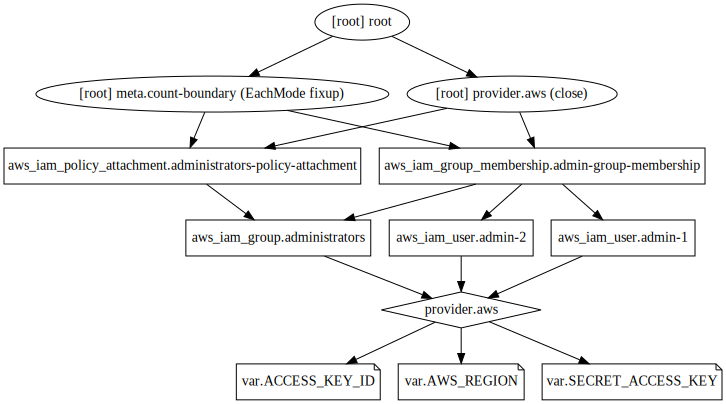

## Example 16
* We'll first create an IAM group.
* Then attach an AWS managed policy to it.
* Then add users to the group.
* Then verify if the users get the permissions via group attached policies.
* We don't set user password via terraform as this may store the password in terraform state file and is a security risk.
* So, set user password after provisioning from AWS console.

## Steps
Created `terraform.tfvars, var.tf, provider.tf, key_pair.tf, instances.tf, output.tf, id_rsa`.

## Commands
```
terraform init
terraform fmt
terraform validate
terraform plan
terraform apply
terraform destroy
alias svg='terraform graph > example.dot && dot example.dot -Tsvg -o example.svg'
svg
```

## Terraform graph


