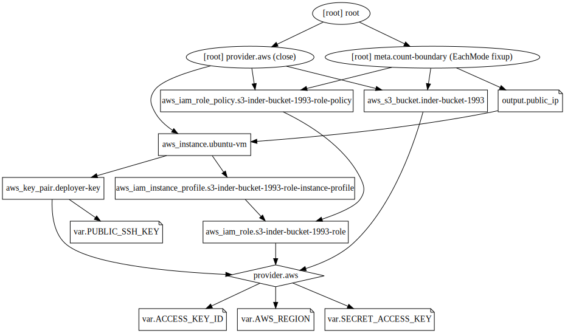

## Example 17
* We'll create an IAM role.
* This will be attached to an EC2 instance.
* The role will have policy attached to it to access S3 bucket.

## Steps
Created `terraform.tfvars, var.tf, provider.tf, iam_role.tf, key_pair.tf, instance.tf, s3.tf, iam_role_policy.tf, output.tf, id_rsa`.

## Commands
```
terraform init
terraform fmt
terraform validate
terraform plan
terraform apply
ssh -i id_rsa -l ubuntu public_ip
sudo su -
apt-get update
apt-get install -y python-pip python-dev
pip install awscli
aws
echo "test" > test.txt
aws s3 cp test.txt s3://inder-bucket-1993/test.txt 
terraform destroy
alias svg='terraform graph > example.dot && dot example.dot -Tsvg -o example.svg'
svg
```

## Terraform graph


