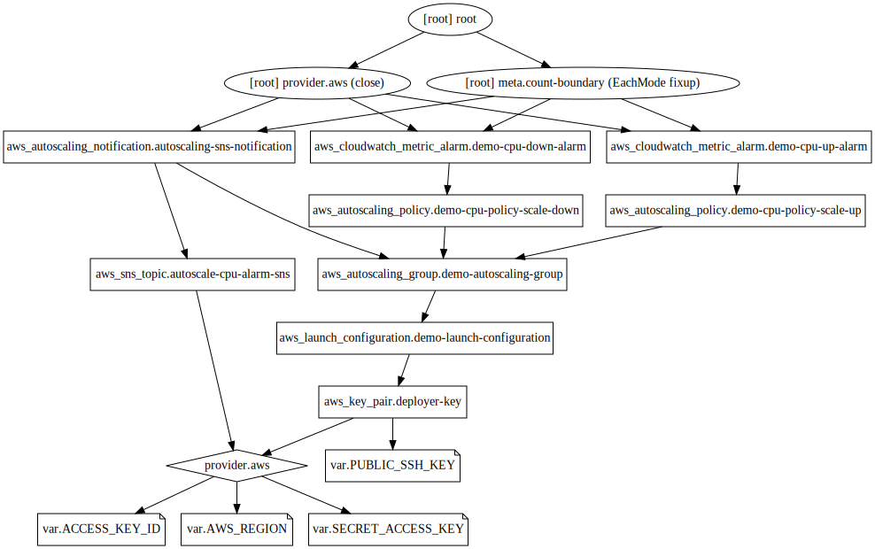

## Example 18
* An autoscaing group consists of two main components,
  1. A launch configuration (which defines AMI id, security group, etc parameters).
  2. An autoscaling group (which defines min_instances, max_instances, health checks, etc)
* First we'll create the launch configuration and autoscaing group in `autoscaling.tf`.
* Subscribe to SNS topic on AWS console for email notifications.
* Check EC2 instances, CloudWatch alarms, SNS topics in AWS console once we initiate the stress test.

## Steps
Created `terraform.tfvars, var.tf, provider.tf, key_pair.tf, autoscaling.tf, sns.tf, id_rsa`.

## Commands
```
terraform init
terraform fmt
terraform validate
terraform plan
terraform apply
ssh -i id_rsa -l ubuntu public_ip
sudo su -
apt-get update
apt-get install -y stress
stress --cpu 2 --timeout 300
terraform destroy
alias svg='terraform graph > example.dot && dot example.dot -Tsvg -o example.svg'
svg
```

## Terraform graph


