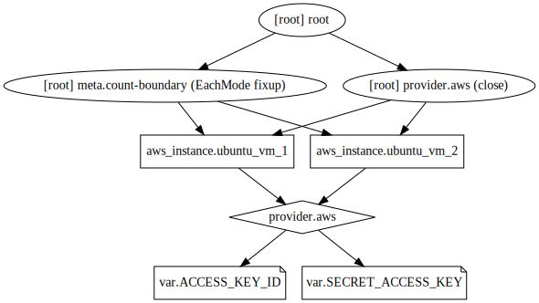

## Example 2
In this example, we'll provision an EC2 instance in AWS. We'll try more options/attributes while refering to this [link](https://www.terraform.io/docs/providers/aws/r/instance.html)

## Steps
* `terraform.tfvars` file created with secret variable assignments.
* `var.tf` file created with variable declarations.
* `provider.tf` created to define AWS provider.
* `resource.tf` created to define our EC2 instance.

## Execution
```
terraform init
terraform validate
terraform plan
terraform apply
terraform destroy
```

## Terraform graph


