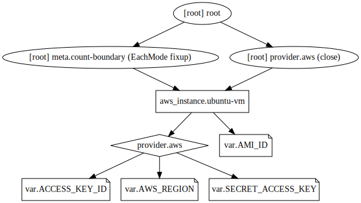

## Example 3
* In this example, we'll provision an EC2 instance.
* But we'll use map variable to specify ami id.
* The region will be enclosed in a variable and this variable will be used as key to lookup ami id value.

## Steps
* Created `terraform.tfvars, var.tf, provider.tf, resource.tf` files.

## Commands
```
terraform init
terraform validate
terraform plan
terraform apply
terraform destroy
terraform graph > example.dot
dot example.dot -Tsvg -o example.svg
```

## Terraform graph


