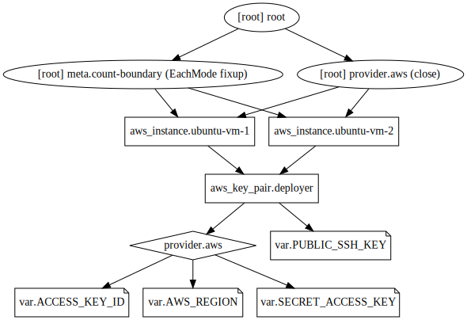

## Example 5
* In this example, we'll copy ssh key to a multiple EC2 instances and try ssh to it.
* Simply providing public ssh key as a variable (without declaring an aws_key_pair) didn't work for me.
* So, I declared the same and called it in aws_instance resource in the `key_name` attribute.
* I had to manually edit the `inbound rule` for the default security group to allow ssh access to the EC2 instance.
* AWS copies the suppied public ssh key to the used AMI's default user's home directory in `.ssh/authorized_keys` file.
* Since, we're using ubuntu AMI, we need to use `ubuntu` user to ssh to the remote host.

## Steps
Created `terraform.tfvars, var.tf, provider.tf, resource.tf`.

## Commands
```
terraform validate
terraform plan
terraform apply
ssh -i id_rsa ubuntu@public_ip
terraform destroy
terraform graph > example.dot
dot example.dot -Tsvg -o example.svg
```

## Terraform graph


