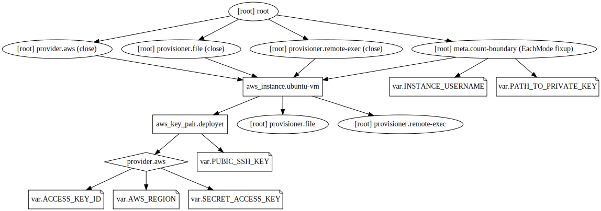

## Example 7
* In this example, we'll upload a script using `provisioner` to EC2 instance.
* We'll then execute this script on EC2 instance using `remote exec`.
* We'll then ssh to EC2 instance and check results of our script.
* The `inbound rule` for the default security group of the default VPC in Singapore region is already edited to allow ssh access to the EC2 instance from any IP for previous examples. So, all new EC2 instances provisioned in this VPV and attached to default security group will have SSH access enabled.

## Steps
Created `terraform.tfvars, var.tf, provider.tf, resource.tf, install_docker.sh, id_rsa`. In the end we sshed into our host and executed `sudo systemctl status docker` and found docker to be running :)

## Commands
```
terraform validate
terraform plan
terraform apply
ssh -i id_rsa ubuntu@public_ip  # Verify our copied file.
terraform destroy
alias svg='terraform graph > example.dot && dot example.dot -Tsvg -o example.svg'
svg
```

## Terraform graph


