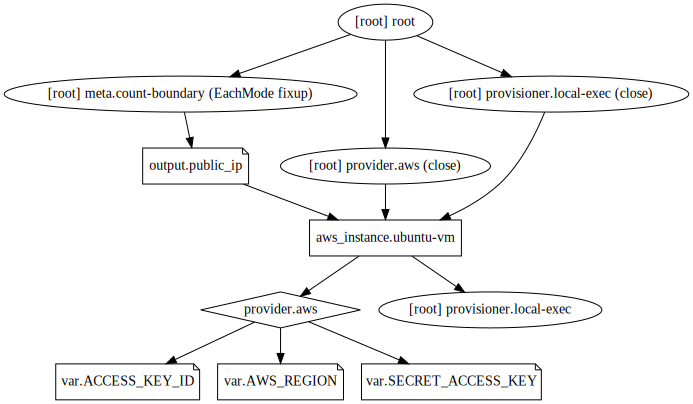

## Example 9
* In this example, we'll provision an EC2 instance.
* Then we'll output its private IP attribute using `local-exec` provisioner.
* Then we'll output its public IP attribute using `ouput` block.
* The output name/identifier and attribiute name can be same.

## Steps
Created `terraform.tfvars, var.tf, provider.tf, resource.tf`.

## Commands
```
terraform init
terraform validate
terraform plan
terraform apply
terraform destroy
alias svg='terraform graph > example.dot && dot example.dot -Tsvg -o example.svg'
svg
```

## Output
We get below output, after `terraform apply`,

```
aws_instance.ubuntu-vm: Provisioning with 'local-exec'...
aws_instance.ubuntu-vm (local-exec): Executing: ["/bin/sh" "-c" "echo 172.31.19.45 >> private_ip.txt"]
aws_instance.ubuntu-vm: Creation complete after 25s [id=i-01b71afc25e72978b]

Apply complete! Resources: 1 added, 0 changed, 0 destroyed.

Outputs:

public_ip = 54.169.178.89
```

We need to mention `${aws_instance.ubuntu-vm.private_ip}` in `echo` command, so that it outputs its value into private_ip.txt file. Otherwise if we mention `aws_instance.ubuntu-vm.private_ip` without `${}`, then it'll output `aws_instance.ubuntu-vm.private_ip` words into private_ip.txt file.

## Terraform graph


